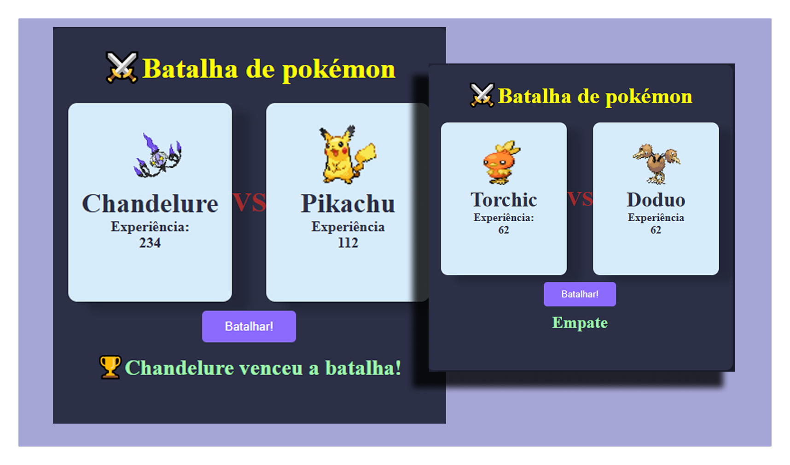

<h1 align="center"> 
	  🚀✅ Batalha-pokemon - Concluído ✅🚀
</h1>

<!-- MODELO MENU DE NAVEGAÇÃO -->
<p align="center">
 <a href="#-Descrição-do-entregável">Descrição do Entregável</a> •
 <a href="#-sobre-o-projeto">Sobre</a> •
 <a href="#-funcionalidades">Funcionalidades</a> •
 <a href="#-layout">Layout</a> • 
 <a href="#-como-executar-o-projeto">Como executar</a> • 
 <a href="#-tecnologias">Tecnologias</a> • 
 <a href="#-autor">Autor</a> • 
 <a href="#user-content--licença">Licença</a>
</p>

## 💻 Sobre o Projeto

Esse projeto foi proposto durante o curso de **JavaScript**.  
A ideia era criar uma batalha entre dois Pokémon usando a PokéAPI, mostrando qual tem mais experiência.  
Se os dois tiverem a mesma, o resultado exibe um empate.


## 📄 Descrição do entregável

- `index.html`: arquivo principal do projeto  
- `src`: pasta que contém os arquivos fonte do projeto  
  - `styles`: folhas de estilo CSS  
  - `js`: arquivos JavaScript
    
 
## 🎨 Layout



 ### ✅ Pré-requisitos
  
 - Navegador web moderno (Chrome, Firefox, Edge, Safari) para abrir e testar o projeto  
 - Editor de código recomendado: Visual Studio Code

## 🚀 Como executar o projeto

1. Clone o repositório:
   ```bash
      https://github.com/Joao-vitorSantos08/Batalha-pokemon.git
2. Acesse a pasta do projeto:
   
   ```bash
   cd Batalha-pokemon

## 🚀 Tecnologias utilizadas

- **HTML** – Estrutura da página
- **CSS** – Estilização dos elementos
- **JavaScript** – Lógica e manipulação da DOM
- **PokéAPI** – API usada para obter os dados dos Pokémon

## 🛠️ Ferramentas
 
- **Git** – Controle de versão  
- **GitHub** – Hospedagem e gerenciamento do código-fonte  
- **Visual Studio Code** – Editor de código usado no desenvolvimento 

<!-- MODELO DE COMO CONTRIBUIR PARA O PROJETO -->
## 💪 Como contribuir para o projeto

1. Faça um **fork** do projeto.
2. Crie uma nova branch com as suas alterações: `git checkout -b my-feature`
3. Salve as alterações e crie uma mensagem de commit contando o que você fez: `git commit -m "feature: My new feature"`
4. Envie as suas alterações: `git push origin my-feature`
> Caso tenha alguma dúvida confira este [guia de como contribuir no GitHub](./CONTRIBUTING.md)

---

## 👨🏽‍💻 Autor

<a href="https://www.linkedin.com/in/jo%C3%A3o-vitor-santos-souza-844306360/">
João Vitor Santos souza</a>
 <br />

## 📝 Licença

Este projeto esta sobe a licença [MIT](./LICENSE).

Feito por João Vitor Santos Souza👋🏽

